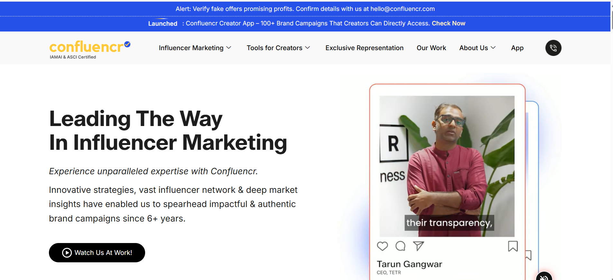
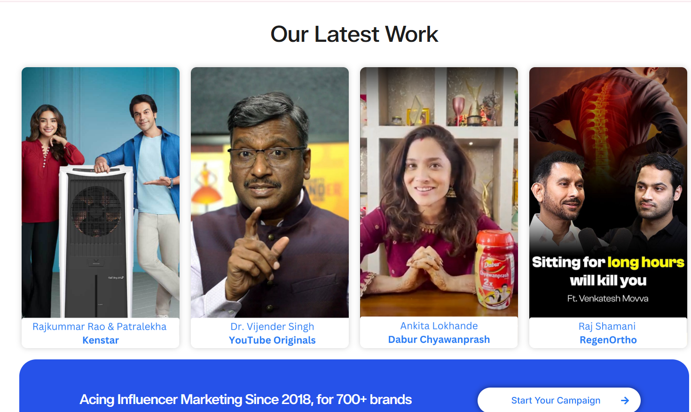
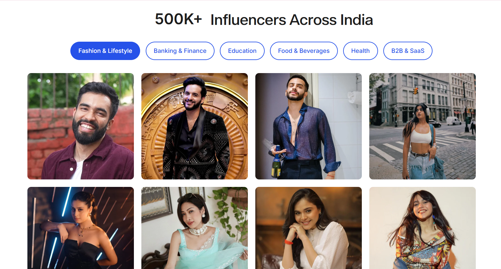
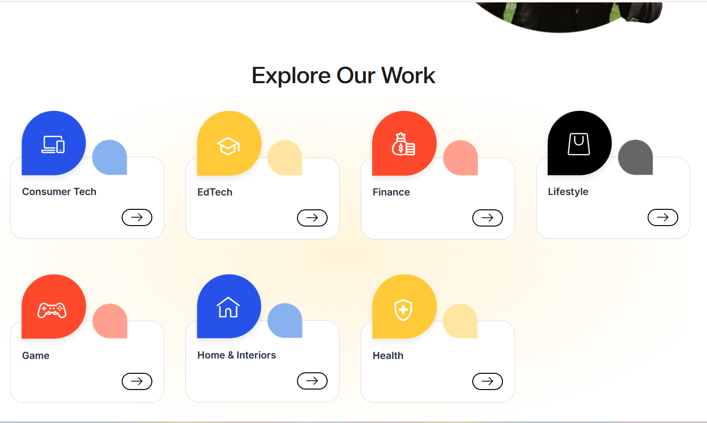
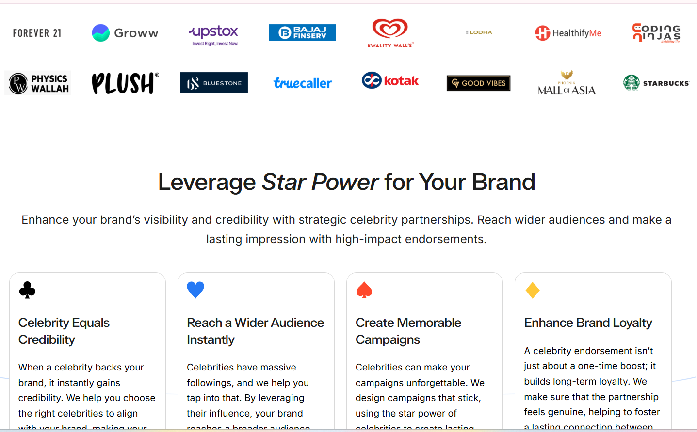
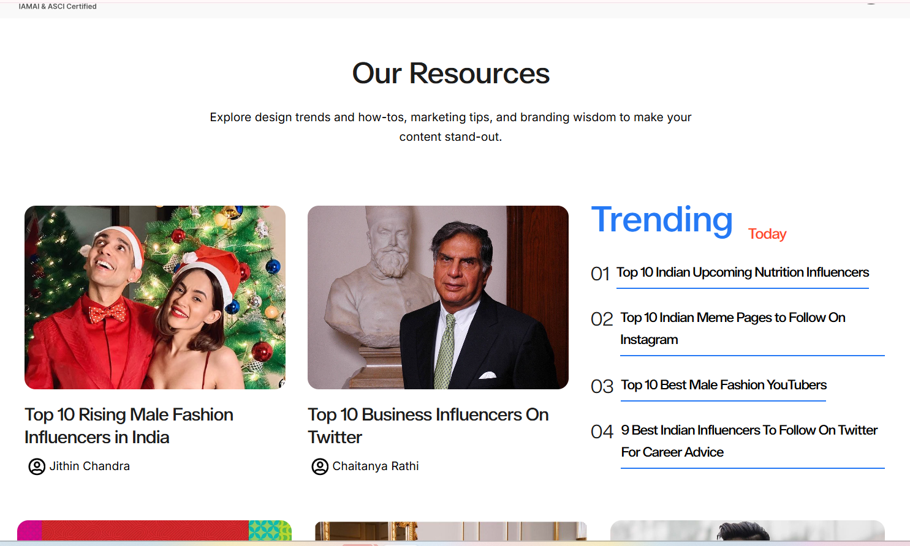
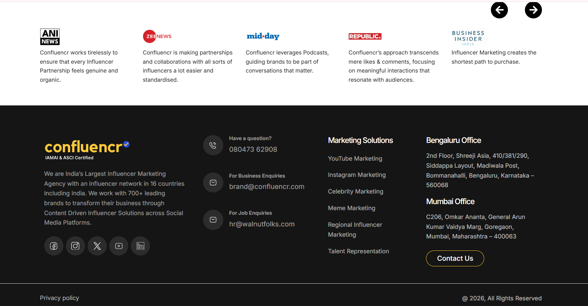

# 🌐 WordPress Website Development

Professional WordPress website development and customization showcasing modern UI, responsive design, custom layouts, content sections, blog functionality and user-focused experiences.

## 🚀 Project Overview

This project showcases my WordPress development experience in building and customizing a professional business website with a modern, responsive and conversion-focused interface.

The website includes custom page layouts, service/work sections, blog content, detailed pages and responsive front-end implementation.

---

## ✨ Key Features

- 🎨 Custom WordPress website design
- 📱 Fully responsive layout
- 🏠 Custom homepage sections
- 💼 Work / portfolio showcase
- 📝 Blog functionality
- 📄 Detailed content pages
- 🧭 Custom navigation
- 🔻 Custom footer
- ⚡ Performance-focused development
- 📱 Mobile-friendly experience
- 🔍 SEO-friendly website structure
- 🧩 Custom WordPress functionality

---

## 🛠️ Technologies

| Technology | Usage |
|---|---|
| WordPress | CMS & Website Development |
| PHP | Custom functionality |
| HTML5 | Website structure |
| CSS3 | Styling & responsive design |
| JavaScript | Interactive functionality |
| Elementor | Page development & customization |
| ACF | Custom fields & content |
| Responsive Design | Mobile & tablet optimization |

---

## 📸 Project Showcase

### 🏠 Homepage

A modern homepage designed to present the business, services, key information and primary calls-to-action.

### 🏠 Homepage — Additional Sections

Additional homepage sections showcasing content, services and visual elements.

### 🏠 Homepage — Content & Layout

Custom content sections designed to improve the overall user experience and presentation.

### 💼 Work / Portfolio

A dedicated work section for presenting projects, services or previous work in a visually engaging layout.

### 📄 Details Page

Detailed content layout with structured information and a clean, user-friendly interface.

### 📝 Blog

Custom blog layout for publishing articles, updates and business-related content.

### 🔻 Footer

Custom footer with navigation, useful links and supporting website information.

---

## 💻 WordPress Development Expertise

### Website Development

- Custom WordPress websites
- Business websites
- Landing pages
- Corporate websites
- Responsive development
- Custom page layouts

### Elementor

- Elementor page development
- Custom Elementor sections
- Responsive customization
- Advanced layouts
- Elementor troubleshooting

### Custom Development

- Custom PHP
- Custom WordPress templates
- Custom fields
- ACF
- JavaScript
- CSS customization
- Third-party integrations

### Performance & Optimization

- Website speed optimization
- Image optimization
- Mobile optimization
- Script & CSS optimization
- Performance troubleshooting

---

## 🤝 Agency & White-Label Development

I also work with **digital agencies, design studios and marketing agencies** as a white-label development partner.

Agencies can outsource development while keeping the complete client relationship.

### Agency Support

- WordPress development
- Elementor development
- WooCommerce development
- Custom PHP
- Shopify development
- Theme customization
- Bug fixing
- Website maintenance
- API integrations
- Development overflow

Available for:

**Project-based | Hourly | Long-term Partnership | White-label Development**

---

## 👨‍💻 About Me

I'm **Vinay Gupta**, a freelance Shopify & WordPress developer with **8+ years of experience** in website and e-commerce development.

I work directly with businesses and also partner with digital agencies that need reliable development support.

### Core Expertise

- Shopify
- Shopify Liquid
- Shopify 2.0
- WordPress
- WooCommerce
- Elementor
- ACF
- PHP
- JavaScript
- HTML
- CSS
- API Integrations
- E-commerce Development

---

## 🛍️ Shopify Expertise

In addition to WordPress, I specialize in Shopify development including:

- Shopify store development
- Shopify 2.0
- Custom Liquid
- Theme customization
- Custom sections
- Metafields & Metaobjects
- Product & collection customization
- Shopify migrations
- App integrations
- API integrations
- Speed optimization

---

## 🔗 Connect With Me

### Shopify Partner

[View my Shopify Partner Profile](https://www.shopify.com/partners/directory/partner/airwebs)

### GitHub

[View my GitHub Profile](https://github.com/vnyvin123)

---

## 📩 Available for Projects

I'm available for **freelance Shopify & WordPress projects** and agency partnerships.

If you need help with a new website, existing website, e-commerce store, migration, customization or ongoing development, feel free to connect.

**Shopify | WordPress | WooCommerce | Liquid | PHP | Elementor | E-commerce**
